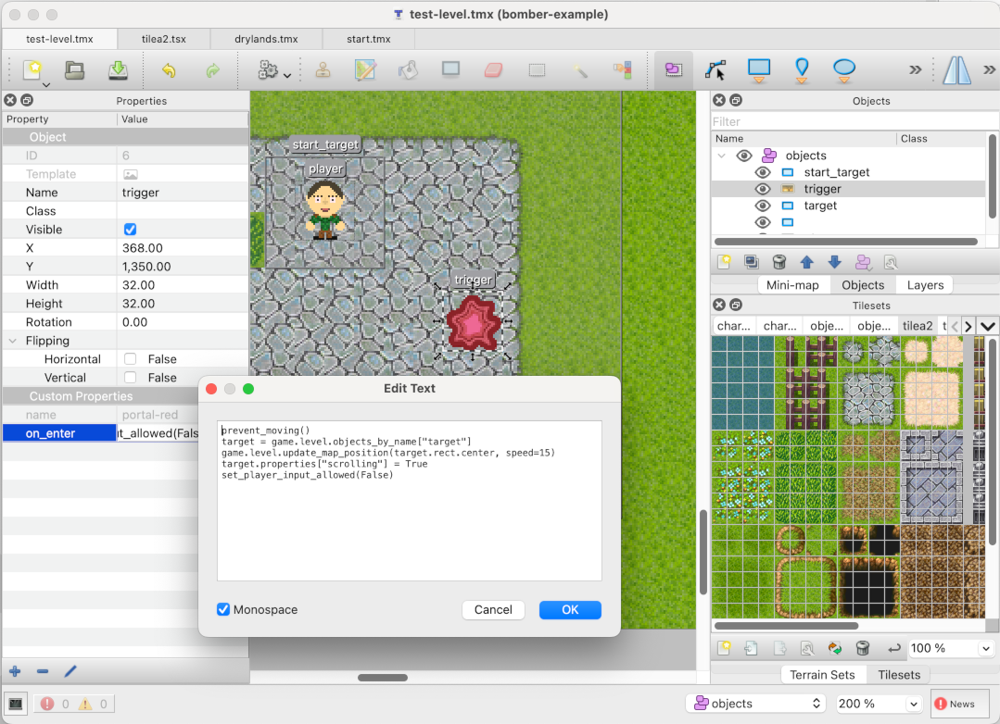
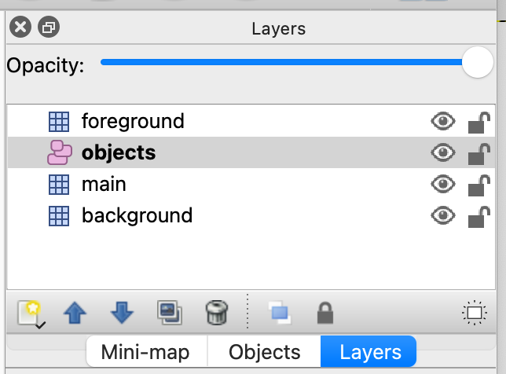

from game.rpg_game_context import RPGGameContext

# Concepts

The main idea is that a game can be made using the engine provided here along with small number of
methods added to 'game context' where majority of actions and logic will reside in
Tiled object's properties.



## Tiled Map

Starting with map, then tiled layer, object layer and each individual object can have custom
properties. The TiledEngine will check for properties like 'on_create', 'on_show', 'on_enter',
'on_leave', 'on_colliding' and 'on_animate' and execute value of those properties as Python
scriptlets on those events (see below for more details). Scriptlets would have access
to special global and local closures (as per [exec](https://docs.python.org/3/library/functions.html#exec)
and [eval](https://docs.python.org/3/library/functions.html#eval) Python built-in functions) :
- globals contain pre-defined methods and properties from 'game-context' classes (see [reference](reference.md))
- locals contain current object and sometimes player object (see [reference](reference.md))

Aside of properties that hold scriptlets, game designers are encouraged to add their own properties
to especially TiledObjects to store states, customise behaviour, etc...

Map itself should have the following layers (some might be omitted):
- 'background' - tiled layer with which player barely interacts and is drawn first
- 'main' - tiled layer which is at the same 'level' as player is - player will collide with elements of main layer
- 'objects' - object layer with objects at x, y coordinates and player will interact with them
- 'foreground' - decorative top layer (rendered last) to allow some shading/hiding when player moves underneath it.



The 'objects' layer should have an object called 'player' - that would be player's initial position.
The TiledEngine will convert TiledObject to Player object keeping all properties attached.

## Code

There are three pieces which TiledEngine provides/prescribes:
- game context
- main (boilerplate) game code
- add ons

### Game Context

TiledEngine has [`GameContext` class](../engine/game_context.py) which is root in
game context hierarchy. It provides collisions, moving player/objects, showing/starting
next level (map) and helper methods like teleporting player at top of (hopefully invisible)
object. More details in [reference docs](docs/reference.md#game-context).

Original `GameContext` class is then extended to provide player input handling. There
are two children classes:
- [`SideScrollerGameContext` class](../game/side_scroller_game_context.py) - for managing input
  for side scroller/platform games
- [`TopDownGameContext` class](../game/top_down_game_context.py) - for managing input of
  top-down games

There's another helper game context [`RPGGameContext` class] which introduced some other
helper elements like inventory and displaying text (if add-ons where included) and moving
objects in 2d space.

After those, it is expected that the game developer will extend the appropriate class
and create their own 'game context' subclass to be used in the game. That is going to
server as a placeholder for all custom logic that has to be written in Python.

To add your method to the 'global' closure available for Python scriplets, just use
`@in-context` decoration above your method. For instance:

```python
class MyGameContext(RPGGameContext):
    def __init__(self, game_context: GameContext) -> None:
        super().__init__()
        self.game_context = game_context

    @in_context
    def hurt_player(self, amount: int) -> None:
        print(f"Player is hurt for {amount}")
```

In your game context you can create your own properties and add them to the 'global' closure:

```python
    @in_context
    @property
    def my_property(self) -> str:
        return self._my_property
```

Now these two can be used in scriptlets like:

```python
if "shield" not in player.properties:
    hurt_player()
```

or

```python
player.properties["some_value"] = my_property
```


### Game Code

To start the game we need main Python file which will set up pygame, load fonts and maps,
prepare game context and run main loop.

Example is in [side_scroller_main.py](../examples/side_scroller_main.py) and
[top_down_main.py](../examples/top_down_main.py).

Your code needs to set the screen size and initialise pygame:
```python
screen_size = (1024, 640)

pygame.init()
pygame.font.init()
```

load fonts and open window:

```python
small_font = pygame.font.SysFont("apple casual", 16)
font = pygame.font.SysFont("apple casual", 24)

screen = pygame.display.set_mode(screen_size)
```

load levels and create and set up game context:
```python
levels = Level.load_levels(
    screen.get_rect(),
    "assets/top_down/test-level.tmx")

game_context = TopDownExampleGameContext(levels, font, small_font)
game_context.set_level(levels["test-level"])
game_context.screen_size = screen_size
```

Last but not least, helper [class `Game`](../engine/game.py) is to help with the main loop:
```python
game = Game(
    screen,
    game_context,
    framerate=60, debug=True)

game.before_map = None
game.after_map = game_context.after_map

game.main_loop()
```

You can, of course, create your own class to manage main loop: read input,
layer overlays, draw map and other screen estate stuff and handle the other aspects of the game.
Class [class `Game`](../engine/game.py)  can always be used as an example.


### Add-ons

There are currently two add-ons: inventory and text area.

The inventory is a smart dictionary which will collect 'objects'. It holds
arrays under keys, so when objects with the same name are added they are just
appended to the array under that key.  Also, when `TiledObject` is added to
the inventory it is converted to [`InventoryObject`](../game/overlays/inventory.py).
As many elements of `TiledObject` are preserved, image of original object is displayed
in the inventory overlay.

Text area is displaying lines of text added to it by using `say` or `say_once` methods.
Examples how they are used are in [`TopDownExampleGameContext` class](../examples/top_down_example_game_context.py).
Observe that `Game` object in [top_down_main.py](../examples/top_down_main.py) is configured
with 'after_map' prooperty - a method to be called (and allow more things displayed on screen)
after main map is rendered on screen:

```python
game.before_map = None
game.after_map = game_context.after_map
```
