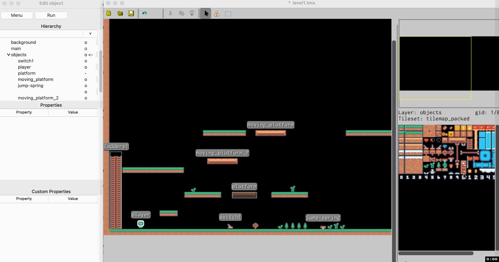

# Coins

If we want to add coins to our game we could do it in following way:

On map itself, on `on_show` property add following code:
```python
text_outline("Ready", "CENTRE", 3)
overlay_image(pygame.transform.scale(level.map.images[152], (24, 24)), "NNW", 0, 0)
coins_text = text_outline("0", "NNW", 0, 1)
player["coins_text"] = coins_text
player["coins"] = 0

def add_coin():
  print("Adding coin...")
  player["coins"] += 1
  coins = player["coins"]
  player["coins_text"].text = str(coins)
  player["coins_text"].draw_outline(context.font)
  print(f"New coins {coins}")

player["add_coin"] = add_coin
```

Here we utilise ability to add overlay (text and image) to the screen. We create 'text' object
(`text_outline` just creates 'outlined text') to put in the middle of screen for 5 seconds.
Then add overlay image on top left corner - NNW (actually next to it in the top left corner along the top side of the screen).
The image is tile image of tile with ID 152 which is scaled up to 24x24 pixels. Last two 
arguments 0 and 0 are for length of time it is displayed on screen (first 0 is for indefinite) and
position in the row from left to right. So, we have indefinite image at position 0.

Next is to add text overlay and safe reference to it. Text overlay is with '0' as value,
indefinitively on the screen and on position 1. That reference (`coins_text`) is saved to
player's object in property called 'coins_text' (`layer["coins_text"] = coins_text`).

Then we set player's property 'coins' to 0 (`player["coins"] = 0`).

Following is definition of `add_coin` method which increases player's property 'coins' for
one and updates 'coins_text' text overlay with the new value.

Last thing is that we 'save' `add_coin` method to player's property 'add_coin' (`player["add_coin"] = add_coin`).

After this complex setup we need to update tile properties for coins adding `on_enter` property,
which, when tile is to be used as an object will be added to the object itself:

```python
remove_collided_object()
player["add_coin"]()
```

This method, removes itself and then invokes `add_coin` method on the player.

Last bit is to add objects using that tile:



## Animations

These coins are animated. To do so add following property to coin tile itself
(the tile with id 151 in our example):

`animated_id`

```python
152,350
```

This means that after 350ms we will change tile image to one of tile id 152 (next one).

On the tile with tile id 152 we will have same:

`animation_id`

```python
151,350
```

So, we can return to the image of the first tile after another 350ms (1/3 of the second).
