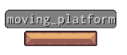
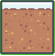

# Examples

This doc is showing some ideas and examples what can be done with Tiled Engine

## Create object consisting of multiple tiles

If you want object o consist of multiple tiles, for instance a platform add following property:

`create_image`

with value of two-dimensional Python array:

`[[49, 50, 50, 50, 51]]`

The above will create 1 x 5 object that looks like this:



To create 2d box, for instance you can use following:

`[[102, 103, 104], [122, 123, 124], []]`

to get:




## Switch To Show Object

If you would like to use one object as a switch and make another object appear when your player touches
it add following properties:

`on_enter`

```python
obj.tile = 67  # tile_id of engaged switch 
object_by_name["platform"].visible = True
```

## A Platform

First we need to multi-tiled object:

`create_image` : `[[49, 50, 50, 50, 51]]`

and then prevent player going through it:

`on_enter` : `prevent_colliding()`


## Moving Platform

For object to become moving platform we need to do several things:

- `create_image` : `[[49, 50, 50, 50, 51]]`
- `on_create` : `obj.vx = 1`  # making platform moving to the right
- `on_enter` : 
    ```python
    prevent_colliding()
    if obj.y > player.y:
        obj["sitting"] = "true"
    ```
- `sitting` : `false`
- `on_animate` :
    ```python
    this.x += this.vx
    
    if this["sitting"] == "true":
        this["sitting"] = "false"
        player.x += this.vx
    
    if this.x <= 440 or this.x >= 600:
        this.vx = - this.vx
    ```
In `on_enter` property we are checking if player is 'above' the object and in that case
we tell object that player is 'sitting' on it.

Here we used internal `obj.vx` property to automatically move object around.

If we are to do it all manually we wuold need following:

- `create_image` : `[[49, 50, 50, 50, 51]]`
- `on_create` : `obj.vx = 1`  # making platform moving to the right
- `on_enter` : 
    ```python
    prevent_colliding()
    if obj.y > player.y:
        obj["sitting"] = "true"
    ```
- `sitting` : `false`
- `direction` : `1`
- `on_animate` :
    ```python
    obj.x += float(obj["direction"])
        
    if obj["sitting"] == "true":
        obj["sitting"] = "false"
        obj.x += float(obj["direction"])
        
    if obj.x <= 250 or obj.x >= 800:
        obj["direction"] = str(-float(obj["direction"]))
   ```

In this case we haven't used `obj.vx` (or `obj.vy`), but separate property on object called
`direction` which not only kept direction but speed of movement. In `on_animate` property
we needed manually to move object during each frame - which is not as optimal as using
`obj.vx` and `obj.vy` properties of the object itself.


## Spring Board

Another frequently seen object in side platformers is a 'sprint board'. to achive that we
can do following:

- `count_down` : `0`
- `on_enter` :
    ```python
    player.vy = -45
    obj.tile = 109
    obj["count_down"] = 20
    ```
- `on_animate` : 
    ```python
    c = int(obj["count_down"])
    if c > 0:
        c -= 1
        obj["count_down"] = c
        if c == 0:
            obj.tile = 108
    ```

Here in `on_enter` we propel player up by using `player.vy` value and set it to upwards motion.
At the same time we change spring's tile to compressed tile and then set object's 'count_down' property
to 20 (frames). In `on_animate` we get this 'count_down' value and if it is bigger than 0 start
count down. The moment it reaches back to '0' we 'decompress' the sprint.
