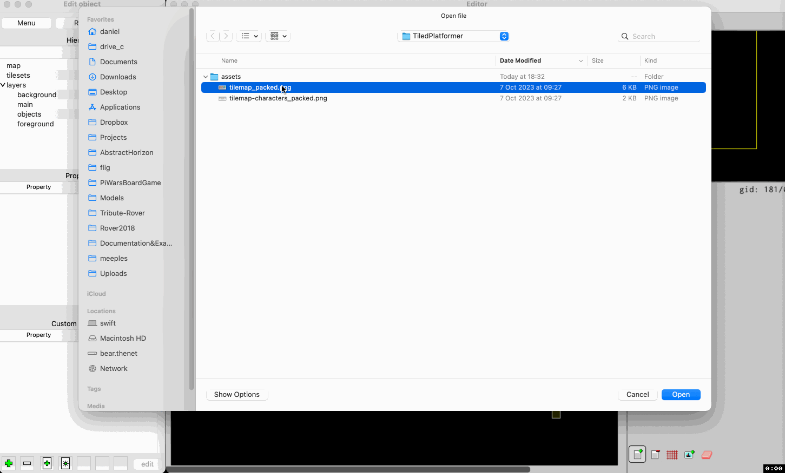
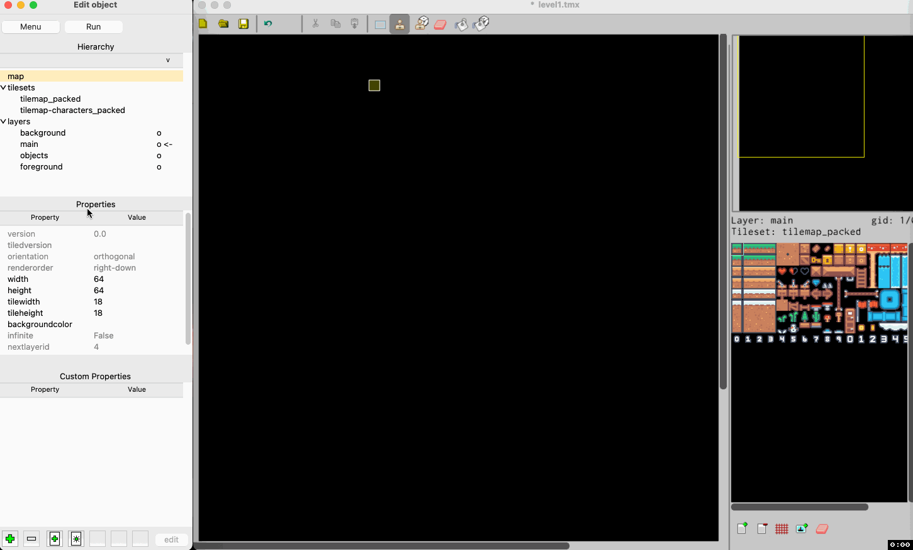
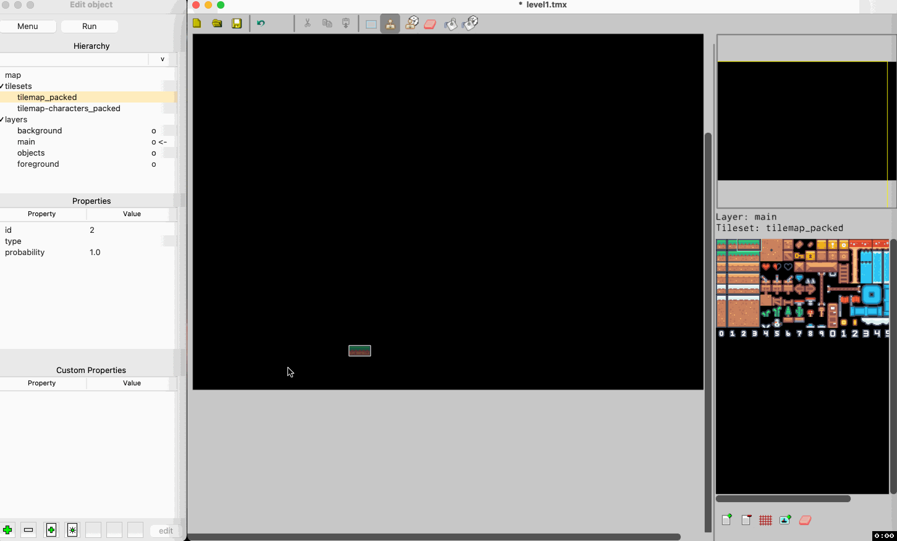
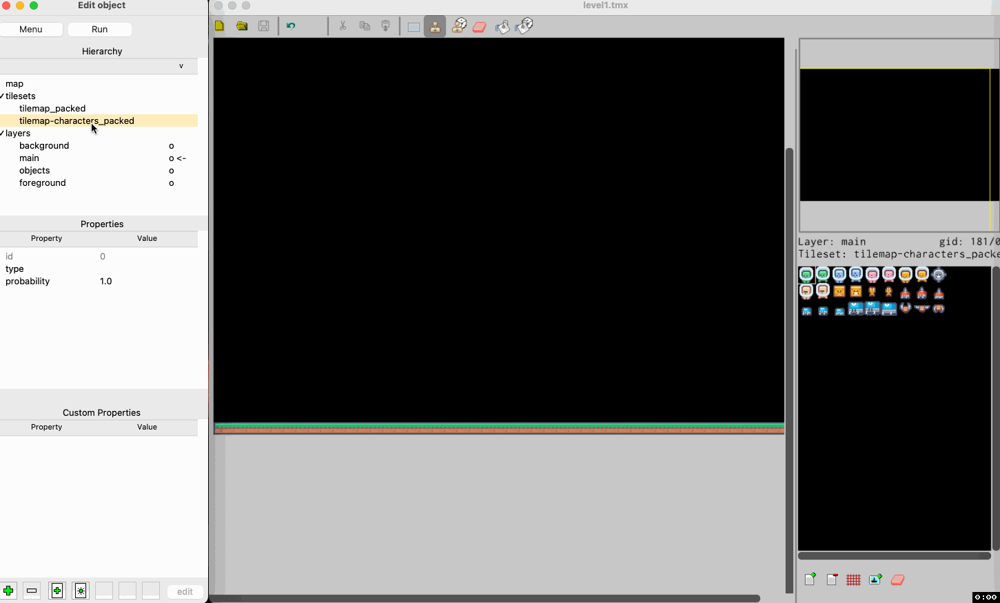
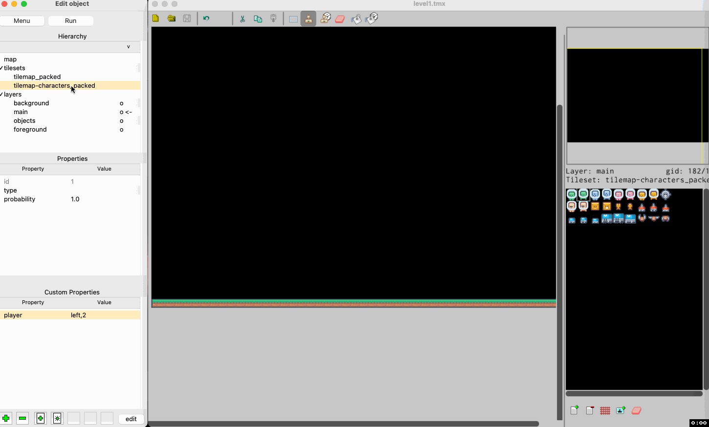
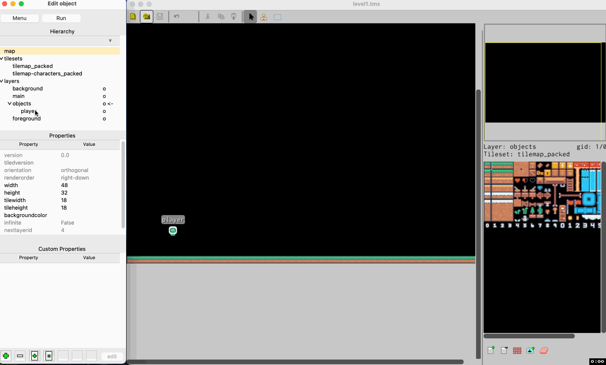

# Getting Started

This is set of simple recipes how to start making a game with TileEngine - Tiled compatible 
editor and Tile Engine.

First open TileEngine editor and add tilesets.

For example here I've used https://kenney.nl free assets - more precisely
[Pixel Platformer](https://kenney.nl/assets/pixel-platformer). All kudos to Kenney
for sharing them and please at least attribute all free resources downloded form the internet.

Note: Make sure you know your tileset's tile size (width and height).

When you have imported tilesets, you can shape your level:

Next you can select a tileset to 'draw' with and start making your level. For instance:

Next step is to define 'player' and animation of player. To achieve that we'll add
a property called 'plaery' on player's tiles with value 'left,1' and 'left,2' a current tileset has only
images of player looking at left. If you defined only 'left' or only 'right' images, the engine
will create symmetrical opposite. That doesn't work with 'up' and 'down' values which still
can be added. If value has ',' after 'left', 'right', 'up' or 'down' it will be treated as
a frame in the animation.

Note: This property name 'player' is going to be matched to object's 'type' property. TileEngine
is really flexible and if 'type' property is not set on an object, it will use 'name' property instead.

Let's add player to the map:

Here we have added object and named it 'player'. For TileEngine to work it must have one and
only one object called 'player'.

Now we can ask TileEngine editor to create a boilerplate python game and run it for us:

You can see it created folders 'game' and 'engine' along with 'my_platformer.py' and 'my_platformer_context.py'
python files. File 'my_platformer.py' is main file and as long as you have 'pygame' in installed in
Python environment you can run it.

That process will also add property called 'python_file' to the map itself so it knows which
file to run:

That file is only a helper for the editor itself - it is not used in the engine anywhere.
