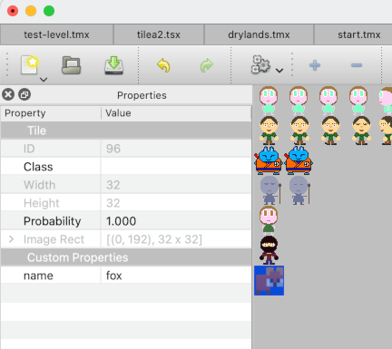

# Reference

## <a name="tiled-objects"></a>Tiled Objects

### Map

Map object (defined in [`TiledMap` class](../engine/tmx.py)) has two scriplets properties:

- "on_create" - if present it will be executed only once. The moment it is executed new property
  will be added to the map properties called '_on_create_executed' with value 'True'.
  When executed following local values are passed in:
  - 'level' - instance of the [`Level` class](../engine/level.py)

- "on_show" - if present it will be executed each time map is set to be 'main' map. That
  happens typically a beginning of the each 'level'/'map' in the game.

### Tiled Layer

Tiled layer [`TiledTileLayer` class](../engine/tmx.py) currently doesn't have any
special properties catered for.

### Object Layer

Object layer [`TiledObjectGroup` class](../engine/tmx.py) currently doesn't have any
special properties catered for.

### Object

Objects in object layer [`TiledObject` class](../engine/tmx.py) instances have following
scriplet properties handled:

- "on_create" - if present it will be executed each time map is set as a main map.
  When executed following local values are passed in:
  - 'level' - instance of the [`Level` class](../engine/level.py)
  - 'obj' - reference back to the object ([`TiledObject` class](../engine/tmx.py) instance)
    that is being 'created'

- "on_enter" - if present it will be executed when player tries to 'enter' - collide with the
  object.
  When executed following local values are passed in:
  - 'this' - player (or another moving object) that performed move and collided with the
    object in the object layer.
  - 'obj' - object that has been hit/tried to be collided with.

  **Note**: Normaly player is 'this' and hit object 'obj'

- "on_leave" - if present it will be executed when player stops being over this object - stops
  colliding with the object.

  When executed following local values are passed in:
  - 'this' - player (or another moving object) that performed move and stopped colliding with the
    object in the object layer.
  - 'obj' - object that has been hit/tried to be collided with.

  **Note**: Normaly player is 'this' and hit object 'obj'

- "on_collision" - if present it will be executed as long as player moves over the object.

  When executed following local values are passed in:
  - 'this' - player (or another moving object) that performed move and collided with the
    object in the object layer.
  - 'obj' - object that has been hit/tried to be collided with.

  **Note**: Normaly player is 'this' and hit object 'obj'

- "on_animate" - if present it will be executed every frame.

  When executed following local values are passed in:
  - 'this' - player (or another moving object) that performed move and collided with the
    object in the object layer.
  - 'obj' - object that has been hit/tried to be collided with.
  - 'elapsed_ms' - number of milliseconds that elapsed since last call.

  **Note**: Normaly player is 'this' and hit object 'obj'

- "on_click" - if present it will be executed when user clicks left mouse button on an object.

  When executed following local values are passed in:
  - 'obj' - object that has been clicked on.
  - 'pos' - x, y coordinates (on the screen) where click happened.


### TileSet

TODO

### Tile in TileSet

TODO

## <a name="game-context"></a>Game Context

Game context by default has the following properties in the global closure:

- `context` - the game context itself
- `game` - the game context itself - alias of 'context'
- `properties` - properties held at the game context level. They persist between
  changing 'levels'/'maps'
- `player` - the player object
- `math` - imported math module
- `level` - current level - ['Level' class](../engine/level.py)

### Class `GameContext`

Also, [`GameContext`](../engine/game_context.py) defines following properties:

- `tiles_by_name` - when tileset ([`TiledTileset`](../engine/tmx.py)) has custom
  properties on individual tiles called 'name' - that tile's gid is going to be
  available in this property

  

  In a scriplet you can use:

  ```python
  obj.tile = tiles_by_name["chest-open"]
  ```
  This is proper (chained) dictionary of all tiles with given names.

- `object_by_name` - it will return first object that matches given name. It doesn't
  implement any other method but `__getitem__` so it won't work as proper dictionary.

  Example:
  ```python
  target = objects_by_name["target"]
  ```

And following methods:

- `distance_from_player(obj: TiledObject)` - this will calculate distance of
  given object and player.
- `set_player_input_allowed(allowed: bool)` - this will prevent player input being
  processed or allowed again:
  ```python
  set_player_input_allowed(False)
  ```
- `move_object(obj: PlayerOrObject, x: float, y: float, test_collisions: bool = False, absolute: bool = False)` - this
  will move selected object (or player) by given x, y offset (or given coordinates if you
  add `absolute=True`). Also, if `test_collisions` is set to `True` it'll check if object (or player)
  can be moved by given offset (or to absolute coordinates) checking all collisions

- `prevent_moving()` is to be called inside "on_entry", "on_collision" callbacks to prevent
  player (or object) completing asked move.

- `prevent_colliding()` is to be called inside "on_entry", "on_collision" callbacks to prevent
  player (or object) colliding - it'll still move but pretend it never collided the object.

- `is_player(obj: TiledObject)` - checks if tiled object is the player

- `remove_object(obj: TiledObject)` - removed object from the object layer

- `remove_collided_object()` - helper method to remove currently colliding object (with the player)
  from the object layer.

- `show_next_level()` - shows next level without setting it as a current level

- `show_previous_level()` - shows previous level without setting it as a current level

- `select_level(name: str, keep_others: bool = False)` - sets level by name. If
  `keep_others=True` then it won't remove other (previous and current level) but just
  keep them not being current.

- `next_level(keep_others: bool = False)` - sets next level from the list to be the
  current level. If `keep_others=True` then it won't remove other (previous and current level) but just
  keep them not being current.

- `previous_level(keep_others: bool = False)` - sets previous level from the list to be the
  current level. If `keep_others=True` then it won't remove other (previous and current level) but just
  keep them not being current.

- `teleport_to_object(who: PlayerOrObject, obj_name: str)` - moves player to centre of
  (hopefully invisible) object. Example:

  ```python
  teleportToObject(player, object_by_name["target"])
  ```
- `push_object(self, this: TiledObject, obj: TiledObject, test_collisions: bool = True` - pushes
  object so it doesn't collide 'this' any more. Example in "on_enter" callback:

  ```python
  push(player, obj)
  ```

### Class `RPGGameContext`

Properties:

- `inventory` - inventory dictionary as defined in [`Inventory`](../game/overlays/inventory.py)

And methods:

- `add_coins(coins: int)` - add coins to the inventory

- `add_object_to_inventory(obj: TiledObject)` - adds object `obj` to the inventory.
  It removes object from the map.
  Example in "on_entry" method:

  ```python
  add_object_to_inventory(obj)
  ```

- `give_object(self, obj_name: str)` - similar to `add_object_to_inventory` but it uses
  object name to find it in all objects in the map. It removes object from the map.

- `set_inventory_visibility(visible: bool)` - sets inventory overlay visibility.

- `say(self, text: str, colour: Optional[Color] = None, expires_in: float = 0.0)` - displayes
  text in the text area unconditionally. `expires_in` is in seconds.

- `say_once(self, text: str, colour: Optional[Color] = None, expires_in: float = 0.0)` - displays
  text in the test area only if previous text hasn't been exactly the same. See `say` for parameters.

- `move_object_away(self, this: TiledObject, obj: TiledObject, at_distance: float, test_collisions: bool = False, above_everything: bool = True)` -
  moves object `this` 'away' from object `obj`. Parameter `at_distance` sets the distance between two objects.
  Parameter `above_everything` checks if `this` is just going to be moved to new x, y position
  or `GameContext.move_object` method will be called (with all logic that is applied in there)

- `move_object_towards(self, this: TiledObject, obj: TiledObject, speed: float, test_collisions: bool = False, above_everything: bool = True)` -
  similar to `move_object_away` but in opposite direction. Parameter `speed` determines how quickly/how far object will be moved.

